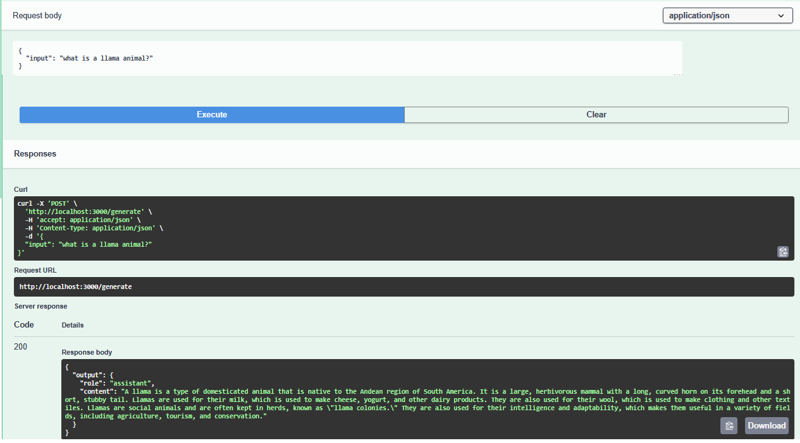

# Vamstar-bentoml-blog

See the [blog post on Medium](https://medium.com/@rfreeman/deploying-your-own-llama-llm-api-in-5-minutes-f0ba281d94f0) for full details.

[](https://medium.com/@rfreeman/deploying-your-own-llama-llm-api-in-5-minutes-f0ba281d94f0)
## Running the service locally

You can run a local BentoML inference server on port 3000
In the terminal, powershell run the following
```bash
bentoml serve src.tinyllama.service:TinyLlamaService
```

Then once it's running you can open the BentoML dashboard in your browser using http://localhost:3000/, which is a web-based user interface for managing and inspecting your BentoML services.

This is an OpenAPI/Swagger user interface that also allows you to run basic prompts directly from the browser.

1. Click on Services API > POST / Generate
2. Click "Try it out" on the right
3. Edit the JSON prompt
```json
{
  "input": "what is a llama animal?"
}
```

4. Click Execute
5. The response will appear under, the time it takes will depend on your RAM, VRAM, GPU on your system.



OK what about testing this automatically using code?

## What about the REST API endpoint?

You can run Python code or the following `curl` command on Linux/Mac
```
curl -X POST http://localhost:3000/generate -H "Content-Type: application/json" -d '{"input": "what is a llama animal?"}'
```
Or Windows PowerShell
```
Invoke-RestMethod -Uri "http://localhost:3000/generate" -Method POST -Headers @{"Content-Type"="application/json"} -Body '{"input": "what is a llama animal?"}'
```

I get the following
```
{"output": {"role": "assistant", "content": "A llama is a type of domesticated animal that is native to the Andes Mountains of South America. It is a small, stocky, and furry mammal with a long, curved nose and a short, stubby tail. Llamas are known for their gentle nature, their ability to herd sheep, and their ability to carry heavy loads. They are also used for their wool, which is used to make clothing and textiles. Llamas are often kept as pets or as working animals, such as shepherds or packers."}}
```
Not bad for a local model, but in most use cases we will need this endpoint available for other services to consume.

## Lets deploy to the BentoML Cloud

1. first you need to authenticate with the BentoML cloud
```
 bentoml cloud login
```
2. In your bentoml.com account under User > API Tokens (create an account if you don't have one)
3. Create a new personal API Token
* Name: api-Token
* Description: API token
* Developer Operations Access toggle on
* Protected Endpoint Access: toggle on
* All deployments
* Expires At: 90 days
Press submit
4. Copy and past the token into the terminal, e.g. `e1fo63evptm5j8650r3b`
5. To deploy your Llama model to the BentoMl cloud you can now run 
```
bentoml deploy
```
6. Once deployed you can find the Endpoint URL on the BentoML cloud, which will look something like this
```
https://tinyllama-1-b-chat-service-rics-b746115c.mt-guc1.bentoml.ai
``` 
which you can curl like above
7. In addition, you can use the interface to `POST` an input like
```
what is a llama animal?
```
and press *Submit*

If you have issues deploying or look at the messages in the terminal, open the deployments Logs on BentoML cloud, I found them very useful for diagnosis.

## Cleanup

You can terminate the deployed service in the BentoCloud console or using the command
```bash
bentoml deployment terminate <deployment_name>
```
the `<depoyment_name>` is in the shown in the Terminal when you deployed or in the BentoCloud Web interface.